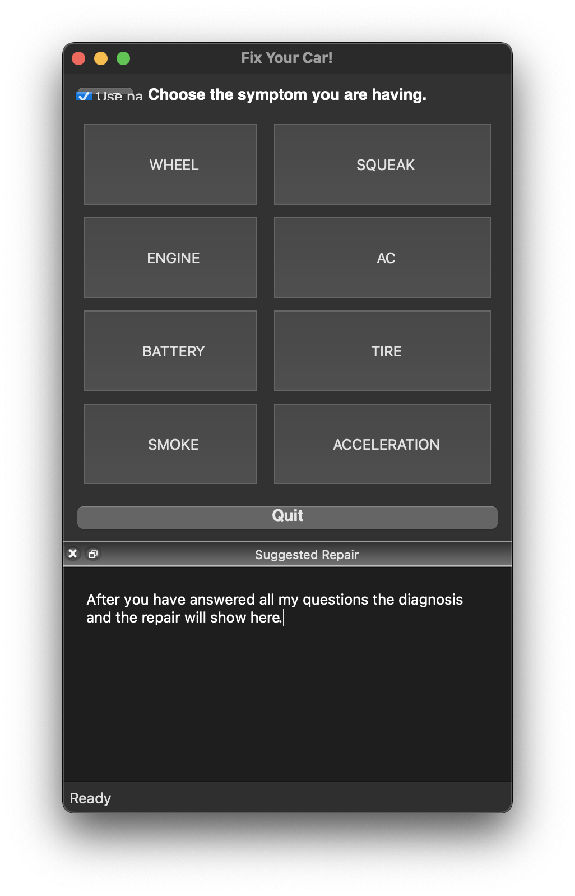

# AI Auto Repair



## About

<!-- more detail -->

## Configuration

<!-- how to set up -->

This application requires `Qt5` to be installed, and has been tested to work on macOS Big Sur and Ubuntu machines.

### Setting up Qt

#### macOS

Launch terminal and execute the following: `brew install qt`

#### Linux

Launch terminal and execute the following: `sudo apt-get install qt5-default`

### Building
Once Qt is set up, `cd` into the project directory and execute the following commands one line at a time:

```shell
cd app/auto-repair
qmake -project
echo 'QT += widgets' >> auto-repair.pro
qmake
make
```

### Executing
After compilation is complete, if you are on `macOS` you will have `auto-repair.app` within the current directory, while on `Linux` there will be an `auto-repair` executable.

#### macOS

    open -a auto-repair.app

#### Linux

    ./auto-repair


## Licensing & thanks

This project is released under the [MIT License](./LICENSE.txt).

## Changelog

- v1.0.0
